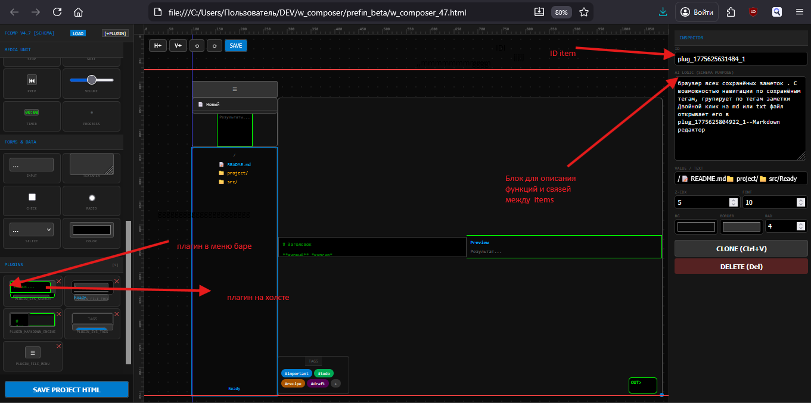

# FComp
FComp v4.7 (FormComposer) is a revolutionary "Architecture-First Prompting" method. Instead of wordy descriptions, you design a visual UI skeleton with unique IDs. The AI sees the structure and simply builds the logic. This eliminates hallucinations, saves up to 300% on tokens, and turns coding into a pure flow of building by blueprints

# 🛠 FCOMP v4.7: Architecture-First Prompting

### "Самый лучший промт — это тот, который уже наполовину решает задачу."

## 🧩 Причина появления (Pain Relief)
Современная работа с ИИ зашла в тупик «многоречивости».
* **Обычный язык = Мусорные токены.** Пытаясь объяснить интерфейс словами, вы тратите тысячи токенов на описание того, что код понимает за долю секунды.
* **Галлюцинации.** Без жесткого скелета ИИ начинает «фантазировать» связи, ломая логику приложения.
* **SEED за деньги.** Огромные системные промты стоят дорого и работают нестабильно.

**FCOMP v4.7 решает это, заменяя слова Архитектурой.**

## 💡 Концепция
Вместо того чтобы писать: *"Сделай мне поле поиска слева, а под ним список..."*, ты просто **рисуешь блоки** в визуальном редакторе.
Каждый блок получает уникальный **ID** и поле **AI_DATA**.

**Твой промт для ИИ теперь выглядит так:**
1. Файл `aka_simple.html` (где уже есть координаты, размеры и ID). (этот файл приведен как пример тоже)
2. Команда: *"Оживи связи между ID_1 и ID_2"*.

**Результат:** ИИ не тратит токены на размышления о дизайне. Он видит «скелет» и просто прокладывает между узлами нервную систему (код).
«Вы получаете ровно тот интерфейс, который спроектировали. ИИ не имеет права менять положение блоков без вашего ведома.
По умолчанию код будет зеркальным отражением скелета. Но в этом и прелесть: как только логика (нервная система) заработала,
 вы даете одну команду: "Примени стиль Cyberpunk/Glassmorphism", и ИИ перекрашивает CSS, не трогая рабочую архитектуру блоков.»

## 🚀 Как это работает (Workflow)
1.  **Прототипирование**: Открываешь `w_composer_47.html`. Накидываешь блоки (инпуты, меню, редакторы).
2.  **Маркировка**: В поле `AI LOGIC` каждого блока пишешь короткое назначение (напр: *"Данные отсюда идут в блок ID_567"*).
3.  **Экспорт**: Сохраняешь схему в один HTML-файл.
4.  **Инъекция**: Скармливаешь этот файл ИИ. Модель видит чистую структуру и выдает код, который **гарантированно** встает в пазы.

## 💎 Преимущества (Suckless Philosophy)
* **Атомарность**: Ошибка в одном блоке? Ты просто указываешь ИИ на его ID. Не нужно переписывать всё приложение.
* **Экономия 300%**: Промт в виде архитектурного скелета в 3-5 раз короче текстового описания.
* **Прозрачность**: 100% кода без лишних зависимостей. Весь проект — это один файл.
* **Поток**: Работа превращается в сборку конструктора LEGO, а не в борьбу с синтаксисом.

## 🛠 Установка и использование
1.  Скачай `w_composer_47.html`.
2.  Запусти локально в любом браузере.
3.  Спроектируй свой "скелет".
4.  Пропиши фнкции блока и логику его связей с другими блоками в ID AI Logic (Schema Purpose)
5.  Отдай результат нейронке с командой: *"Оживи по схеме"*.
6.  Есть направляющие вертикальные по V+ , горизонтальные по H+, работают на прилипание если удерживать ctrl+ перетаскивание

---

### Философское послесловие:
> "Мы не пишем код. Мы создаем условия, при которых код не может не работать."
> — *Адепты FCOMP v4.7*

---                         
